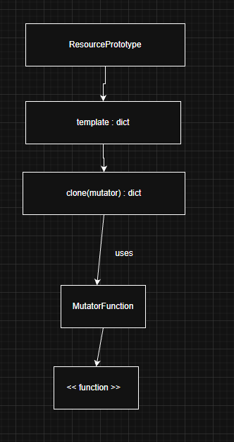

### 1. Singleton: Garantía de Instancia Única

`SingletonMeta` garantiza que una clase tenga **solo una instancia** controlando su creación desde el método `__call__`. Usa un diccionario `_instances` como almacenamiento: si la instancia no existe, la crea y la guarda; si ya existe, simplemente la devuelve.

El `lock` sirve para evitar que **varios hilos creen instancias al mismo tiempo**. Gracias al bloqueo, solo un hilo puede ejecutar la sección crítica donde se verifica y crea la instancia, asegurando que realmente exista **una sola** en entornos concurrentes.

---

### 2. Factory: Encapsulamiento de Creación

La fábrica (`NullResourceFactory`) encapsula la creación de `null_resource` al ocultar la estructura compleja que Terraform exige. El usuario solo llama `create("app")`, y la clase genera internamente el diccionario correcto, evitando errores y estandarizando la forma de crear estos recursos.

Los `triggers` sirven para obligar a Terraform a recrear el `null_resource` cuando cambian. La fábrica agrega un UUID y un timestamp en cada creación, asegurando que los valores siempre difieran y que Terraform vuelva a ejecutar el recurso, algo útil para tareas que deben correr cada vez.

---

### 3. Prototype: Clonación y Mutación

En el patrón Prototype, `ResourcePrototype` crea copias independientes usando **deepcopy**, lo que garantiza que la plantilla original nunca se modifique. Luego, el **mutator** —una función que recibe la copia— permite personalizar cada instancia clonada (por ejemplo, cambiar nombre, puertos, variables), generando variaciones a partir de una misma plantilla sin duplicar configuración.

---

### 4. Composite: Agrupación de Recursos

`CompositeModule` aplica el patrón Composite para reunir varios bloques de configuración en un único JSON aceptado por Terraform. Cada bloque se guarda como un “hijo” en `self.children`, y el método `export()` combina todos esos fragmentos en un solo diccionario maestro. Al usar `setdefault` y `update`, agrupa correctamente recursos bajo las mismas claves (como `"resource"`), produciendo un `main.tf.json` final válido que integra múltiples configuraciones individuales.

---

### 5. Builder: Orquestación

`InfrastructureBuilder` coordina todo el flujo de creación de infraestructura combinando Factory, Prototype y Composite. Primero obtiene una plantilla base usando la Factory; luego la envuelve en un Prototype para poder clonarla. Genera varias copias aplicando mutadores que personalizan cada recurso y las agrega al CompositeModule. Finalmente, el Composite exporta todos los recursos fusionados y el Builder escribe el JSON final listo para Terraform.