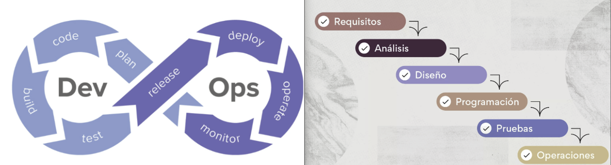
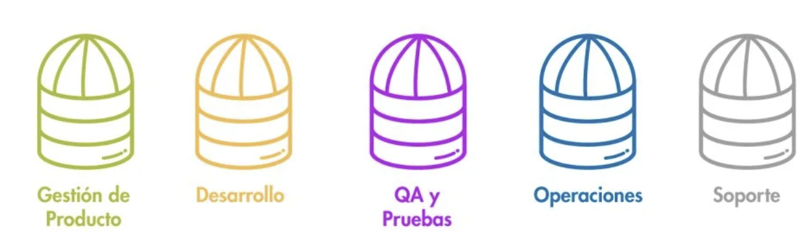
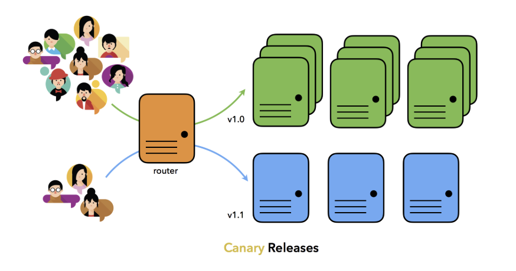

## Choquechambi Quispe Germain Ronald
## hotas invertido: 4:20 horas

# Activdad 1

**4.1 DevOps vs. cascada tradicional (investigación + comparación)**

- Explica por qué DevOps acelera y reduce riesgo en software
El modelo **DevOps** acelera la entrega de software y reduce riesgos frente a la cascada .
    - **feedback continuo**: las pruebas automatizadas detectan errores rapido y haci evita acumulación de fallos y permitiendo corregir rápido.
    - **pequeños lotes de trabajo**: en lugar de grandes lanzamientos que es dificil de manejar, se implementa cambios frecuentes y acotados, lo que facilita pruebas, reversión y control de riesgos.
    - **automatización**: desde pruebas hasta despliegues e infraestructura, elimina tareas manuales, disminuye errores humanos y garantiza procesos más rápidos, seguros y predecibles en la nube.
- **Pregunta retadora:**
    
    **Criterios verificables:**
    
    1. **Revisión de entidades oficiales:** El software debe aprobarse por organismos de salud antes de usarse en pacientes, lo que obliga a seguir un proceso con mucha documentación y validaciones.
    2. **Unión con hardware difícil de cambiar:** El software va dentro de dispositivos como marcapasos, que no se pueden actualizar fácilmente, por lo que debe ser seguro desde el inicio.
    
    **Trade-offs:**
    
    - **Velocidad vs. Seguridad:** Se avanza más lento porque lo principal es que sea seguro y cumpla con todas las normas.
    - **Flexibilidad vs. Estabilidad:** Se da prioridad a mantener los requisitos fijos y la estabilidad, en lugar de hacer cambios frecuentes.

**4.2 Ciclo tradicional de dos pasos y silos (limitaciones y anti-patrones)**

- **limitaciones** del ciclo "construcción -> operación" sin integración continua
    - **Grandes lotes de entrega:** El software se acumula durante semanas o meses antes de que sea  liberado. y en consecuencia esto genera retrasos y aumenta la dificultad para detectar y corregirlos a tiempo.
    - **Colas de defectos:** Los errores encontrados en producción tardan en regresar al equipo de desarrollo, creando cuellos de botella y aumentando el tiempo de resolución.
- **Pregunta retadora:**
    1. **“Throw over the wall” (lanzar por encima del muro):**
        
        
        El anti-patrón **“throw over the wall”** ocurre cuando el equipo de desarrollo termina el código y lo entrega al de operaciones sin colaboración ni contexto. Esto agrava los incidentes porque aumenta el **MTTR(Mean Time To Recovery** o **Tiempo Medio de Recuperación)** al no entender operaciones el diseño, genera **retrabajos** por falta de información y provoca que se repitan las mismas **degradaciones** al no existir retroalimentación hacia desarrollo.
        
    2. **Seguridad como auditoría tardía:**
    El anti-patrón **“seguridad como auditoría tardía”** ocurre cuando el equipo de seguridad revisa solo al final, como un filtro antes de producción, en vez de participar desde el inicio. Esto agrava los incidentes porque las vulnerabilidades se detectan demasiado tarde, lo que genera **retrabajos costosos**, retrasa los lanzamientos y provoca **fallos recurrentes** si las correcciones no se incorporan temprano en el ciclo de desarrollo.
    

**4.3 Principios y beneficios de DevOps (CI/CD, automatización, colaboración; Agile como precursor)**

- **Integración Continua (CI):** se hace cambios pequeños y frecuentes al repositorio principal, con **pruebas automatizadas** (unitarias, de integración) y de esta manera permite detectar errores rapido.
- **Entrega/Despliegue Continuo (CD):** automatiza la promoción de esos cambios hacia entornos superiores (pruebas, staging, producción) de manera segura. Favorece **cambios pequeños, trazables y reversibles**, en lugar de grandes lotes difíciles de controlar.
- **Colaboración:** Dev y Ops trabajan juntos desde el inicio, reduciendo “silos” y acelerando la retroalimentación.

- Explica cómo **una práctica Agile** (reuniones diarias, retrospectivas)
    
    Las **reuniones diarias** permiten detectar bloqueos y decidir qué cambios no deben avanzar en el pipeline. También identifican avances seguros que sí pueden promoverse. Las **retrospectivas** revisan errores y ajustan reglas o pruebas en el pipeline. Así, la retroalimentación de Agile guía qué se promueve y qué se bloquea en la entrega.
    
- **indicador observable** (no financiero)
    
    Un buen indicador observable para medir la colaboración entre Dev y Ops es el *tiempo desde que un Pull Request está listo hasta que se despliega en el entorno de pruebas*. Este valor refleja la fluidez del trabajo conjunto: si el tiempo disminuye, significa que hay menos fricción, más automatización y un ciclo de entrega más ágil y confiable.
    

**4.4 Evolución a DevSecOps (seguridad desde el inicio: SAST/DAST; cambio cultural)**

- Diferencia **SAST** (estático, temprano) y **DAST** (dinámico, en ejecución), y ubícalos en el pipeline.
    - **SAST (Static Application Security Testing):** análisis de código fuente o binarios sin ejecutarlos. Se ejecuta **temprano en el pipeline (fase de build/CI)** para detectar vulnerabilidades como inyecciones o uso inseguro de librerías antes de desplegar.
    - **DAST (Dynamic Application Security Testing):** análisis con la aplicación en ejecución. Se ubica en **etapas de pruebas/preproducción (fase de CD)**, simulando ataques reales contra la app desplegada.
- Define un **gate mínimo de seguridad** con **dos umbrales cuantitativos**
    - **Hallazgos críticos:** cualquier vulnerabilidad crítica en componentes expuestos bloquea la promoción automáticamente.
    - **Cobertura de pruebas:** se requiere al menos un **80% de cobertura en pruebas de seguridad** para que el cambio avance en el pipeline.
- Incluye una **política de excepción** con **caducidad**, responsable y plan de corrección.
    
    
    - **Excepción concedida a:** [nombre del responsable / área].
    - **Fecha de caducidad:** máximo 30 días desde su concesión.
    - **Plan de corrección:** issue/documento con las acciones para resolver el hallazgo antes de la fecha límite.
- **Pregunta retadora:** ¿cómo evitar el "teatro de seguridad" (cumplir checklist sin reducir riesgo)? l
    - Para evitar el “teatro de seguridad” no basta con cumplir checklists, sino que tambien se tiene que demostrar eficacia real. Una señal es la **disminución de hallazgos repetidos**, que puede medirse comparando el número de vulnerabilidades del mismo tipo en reportes de SAST/DAST a lo largo de los sprints; si bajan, significa que el equipo aprende y corrige de raíz. Otra señal es la **reducción en el tiempo de remediación**, que se mide calculando cuánto tarda en promedio la corrección desde que se detecta una vulnerabilidad; si este tiempo disminuye, indica que los riesgos se atienden más rápido y la seguridad mejora de forma tangible.

**4.5 CI/CD y estrategias de despliegue (sandbox, canary, azul/verde)**

- Elige **una estrategia** para un microservicio crítico (por ejemplo, autenticación) y justifica.
    
    Para el microservicio crítico de **autenticación**, la mejor opción es **Canary Deployment**.
    
    **Justificación:**
    
    - Permite exponer la nueva versión solo a un pequeño porcentaje de usuarios al inicio.
    - Si se detecta un fallo, el impacto se limita y se puede revertir rápidamente.
    - Es ideal para servicios de misión crítica donde la **indisponibilidad total no es aceptable**.
    - Facilita pruebas en condiciones reales de tráfico sin comprometer toda la base de usuarios.
- Crear **tabla breve** de **riesgos vs. mitigaciones**:
    
    ### Riesgos vs Mitigaciones
    
    | Riesgo | Mitigación |
    | --- | --- |
    | Regresión funcional | Validación de contrato entre servicios y pruebas automatizadas antes de promover. |
    | Costo operativo del doble despliegue | Establecer límites de tiempo en que conviven versiones (ej. 24h). |
    | Manejo de sesiones activas | Uso de *draining* de conexiones y compatibilidad de esquemas de sesión. |
    | Sobrecarga en logs/monitoreo | Ajustar *sampling* y establecer dashboards específicos para el canary. |
- **KPI primario** y un **umbral numérico** con **ventana de observación** para **promoción/abortado**.
    
    ### KPI primario
    
    - **KPI elegido:** Tasa de errores **HTTP 5xx**.
    - **Umbral:** ≤ **0.5%** en una ventana de observación de **15 minutos** antes de promover la nueva versión.
    - **Criterio de abortado:** Si el valor excede el umbral, se corta el tráfico hacia la nueva versión y se mantiene la estable.
- **Pregunta retadora:** si el KPI técnico se mantiene, pero cae una métrica de producto (conversión), explica por qué **ambos tipos de métricas** deben coexistir en el gate.
    
    - Cuando un KPI técnico, como los errores 5xx o la latencia p95, se mantiene estable, pero una métrica de producto, como la tasa de conversión, comienza a caer, esto sugiere que el sistema está funcionando bien desde un punto de vista técnico. Sin embargo, hay algo que no está bien en la experiencia del usuario o en el flujo del negocio. Podría ser un cambio en la interfaz o un error en la lógica. Por eso, es crucial que ambos tipos de métricas se monitoreen juntos: los KPIs técnicos aseguran que el sistema sea estable y confiable, mientras que las métricas de producto garantizan que los cambios no perjudiquen la experiencia del usuario ni los objetivos comerciales.