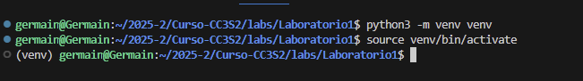

# Actividad2

**1) HTTP: Fundamentos y herramientas**

1. **Levanta la app** con variables de entorno (12-Factor): `PORT=8080 MESSAGE="Hola CC3S2" RELEASE="v1" python3 app.py` (usa tu *venv*). La app **escucha** en el puerto indicado y **loggea en stdout**. Incluye extracto de salida (stdout) en el reporte.

Ativando el entorno virtual

insalando flask con `pip isntall flask` 

1. **Inspección con `curl`:**
    - `curl -v http://127.0.0.1:8080/`
        
        
        
    - `curl -i -X POST http://127.0.0.1:8080/`
        
        
        
        si no existe la ruta. El servidor devuelve un **código de estado 404 Not Found, s**ignifica que la aplicación no tiene registrado ningún endpoint para esa URL.
        
    - **Pregunta guía:** ¿Qué campos de respuesta cambian si actualizas `MESSAGE`/`RELEASE` sin reiniciar el proceso? Explica por qué.
    Si se cambia la variable RELEASE sin reiniciar la app, la respuesta HTTP seguirá mostrando los valores iniciales porque las variables de entorno se leen solo al inicio del proceso. Para poder ver los cambios, es necesario tener que reiniciar la aplicación, ya que en 12-Factor App no se actualiza dinámicamente.
2. **Puertos abiertos con `ss`:**
    
    
    
3. **Logs como flujo:** Demuestra que los logs salen por stdout (pega 2–3 líneas). Explica por qué **no** se escriben en archivo (12-Factor).
    
    
    
    
    **2) DNS: nombres, registros y caché**
    
    1. **Hosts local:** agrega `127.0.0.1 miapp.local` (Linux y/o Windows según tu entorno). Usa el *target* de la guía si está disponible (`make hosts-setup`).
        
        
        
    2. **Comprueba resolución:**
        - `getent hosts miapp.local`
            
            
            
    3. **TTL/caché (conceptual):** con `dig example.com A +ttlunits` explica cómo el TTL afecta respuestas repetidas (no cambies DNS público, solo observa).
        
        
        
    4. **Pregunta guía:** ¿Qué diferencia hay entre **/etc/hosts** y una zona DNS autoritativa? ¿Por qué el *hosts* sirve para laboratorio? Explica en 3–4 líneas.;
        
        `/etc/hosts` es un archivo local y estático que fuerza resoluciones de nombres a IPs en un solo equipo con prioridad inmediata.
        Una zona DNS autoritativa, en cambio, se gestiona en servidores distribuidos y publica registros para todo internet respetando el TTL.
        En laboratorio usamos /etc/hosts porque es rápido, simple y permite simular dominios sin necesidad de configurar un DNS real.
        

**3) TLS: seguridad en tránsito con Nginx como *reverse proxy***

1. **Certificado de laboratorio:** genera autofirmado (usa el *target* `make tls-cert` si existe) y coloca crt/key donde lo espera Nginx (ver guía).
    
    
    
2. **Configura Nginx:** usa el ejemplo provisto para **terminación TLS** y **proxy_pass** a `http://127.0.0.1:8080;` con cabeceras `X-Forwarded-*`. Luego `nginx -t` y **reinicia** el servicio. Incluye el *snippet* clave de tu `server` en el reporte.
    
    
    
3. **Valida el *handshake*:**
    - `openssl s_client -connect miapp.local:443 -servername miapp.local -brief` (muestra TLSv1.2/1.3, cadena, SNI).
        
        
        
    - `curl -k https://miapp.local/`
        
        
        
          **4. Puertos y logs:**
        
    - `ss -ltnp | grep -E ':(443|8080)'`
        
        
        
    - `journalctl -u nginx -n 50 --no-pager` **o** `tail -n 50 /var/log/nginx/error.log` (pega 3–5 líneas relevantes).
        
        
        
    
    **4) 12-Factor App: port binding, configuración y logs**
    
    **Meta:** demostrar tres principios clave en tu app.
    
    1. **Port binding:** muestra que la app **escucha** en el puerto indicado por `PORT` (evidencia `ss`).
        
        
        
    2. **Config por entorno:** ejecuta dos veces con distintos `MESSAGE`/`RELEASE` y documenta el efecto en la respuesta JSON.
        
        
        
        
        
        
        
        
        
    3. **Logs a stdout:** redirige a archivo mediante *pipeline* de shell y adjunta 5 líneas representativas. Explica por qué **no** se configura *log file* en la app.
        
        En una 12-Factor App, los logs se tratan como un flujo continuo de eventos que se envían a stdout/stderr.
        No se configuran archivos de log dentro de la aplicación
        
    
    **5) Operación reproducible (Make/WSL/Linux)**
    
    ### Tabla "Comando -> Resultado esperado”
    
    | Comando | Resultado esperado |
    | --- | --- |
    | `make prepare` | Entorno preparado, dependencias instaladas. |
    | `make run` | App corriendo en el puerto definido por `PORT`. |
    | `make nginx` | Nginx configurado y reiniciado con TLS y proxy_pass. |
    | `make check-http` | Respuesta JSON correcta vía HTTP. |
    | `make check-tls` | Respuesta JSON correcta vía HTTPS, con certificado autofirmado. |
    | `make dns-demo` | Resolución de nombres local y TTL visible. |