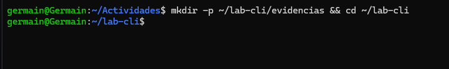

imagenes/# Actividad4

1. Crea la versión redactada (palabras sensibles y pares `clave=valor` / `clave: valor`):
    
    
    
2. Oculta credenciales en cabeceras HTTP (Authorization Basic/Bearer):
    
    
    
3. (Opcional) Quita códigos de color ANSI:
    
    
    
4. Verifica que no queden secretos:
    
    
    

# **Sección 1: Manejo sólido de CLI**

**Ejercicios de reforzamiento**

1. Navega a `/etc`, lista archivos ocultos y redirige la salida a un archivo en tu home: `cd /etc; ls -a > ~/etc_lista.txt`.
    
    
    
2. Usa globbing para listar todos los archivos en `/tmp` que terminen en `.txt` o `.doc`, y cuenta cuántos hay con una tubería (versión robusta): `find /tmp -maxdepth 1 -type f \( -name '*.txt' -o -name '*.doc' \) | wc -l`.
    
    
    
3. Crea un archivo con `printf "Línea1\nLínea2\n" > test.txt`.
    
    
    
4. (Intermedio) Redirige errores de un comando fallido (ej. `ls noexiste`) a un archivo y agrégalo a otro: `ls noexiste 2>> errores.log`. Para borrados con xargs, primero haz un dry-run: `find . -maxdepth 1 -name 'archivo*.txt' | xargs echo rm`.

# **Sección 2: Administración básica**

**Ejercicios de reforzamiento**

1. Crea un usuario "devsec" y agrégalo a un grupo "ops". Cambia permisos de un archivo para que solo "devsec" lo lea: `sudo adduser devsec; sudo addgroup ops; sudo usermod -aG ops devsec; touch secreto.txt; sudo chown devsec:ops secreto.txt; sudo chmod 640 secreto.txt` (usa mock si es entorno compartido).
    
    
    
    
    
2. Lista procesos, encuentra el PID de tu shell (`ps aux | grep bash`), y envía una señal SIGTERM (no lo mates si es crítico).
    
    
    
3. Verifica el estado de un servicio como "systemd-logind" con `systemctl status systemd-logind`, y ve sus logs con `journalctl -u systemd-logind -n 10`.
    
    
    
    ## ver logs
    
    
    
4. (Intermedio) Inicia un proceso en background (`sleep 100 &`), lista con `ps`, y mátalo con `kill`.
    
    
    

**Comprobación**

- `namei -l secreto.txt` (verifica permisos y propietario).
- `id devsec` (confirma grupos).
    
    
    

# **Sección 3: Utilidades de texto de Unix**

**Ejercicios de reforzamienDto**

1. Usa grep para buscar "root" en `/etc/passwd`: `grep root /etc/passwd`.
    
    
    
2. Con sed, sustituye "dato1" por "secreto" en datos.txt: `sed 's/dato1/secreto/' datos.txt > nuevo.txt`.
    
    
    
3. Con awk y cut, extrae usuarios de `/etc/passwd`: `awk -F: '{print $1}' /etc/passwd | sort | uniq`.
    
    
    
4. Usa tr para convertir un texto a mayúsculas y tee para guardarlo: `printf "hola\n" | tr 'a-z' 'A-Z' | tee mayus.txt`.
    
    
    
5. (Intermedio) Encuentra archivos en `/tmp` modificados en los últimos 5 días: `find /tmp -mtime -5 -type f`.
    
    
    
6. Pipeline completo: `ls /etc | grep conf | sort | tee lista_conf.txt | wc -l`.
7. (Opcional) Usa tee para auditoría: `grep -Ei 'error|fail' evidencias/sesion.txt | tee evidencias/hallazgos.txt`.